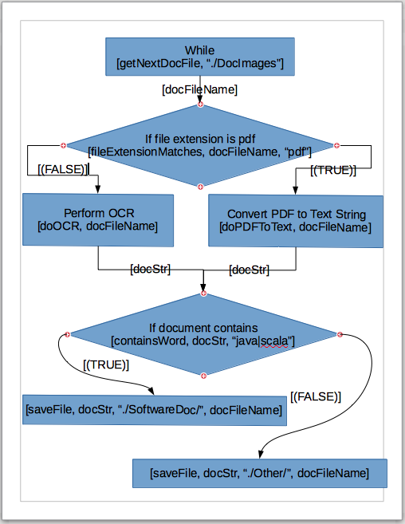

# DocRouter
Java Framework that routes document images through a configurable workflow process.

This workflow defines the order of events by utilizing the Open Source designer tool, <a href=https://en.wikipedia.org/wiki/LibreOffice>LibreOffice</a>, with corresponding connected shapes.

  

One transformation defined in the workflow as illustrated above, doOCR, will perform Optical Character Recognition on supplied document images utilizing the <b><a href=https://en.wikipedia.org/wiki/Tesseract_(software)>Tesseract-OCR</a></b> library.

<b>To install and run the attached Java Frameework:</b>

<b>Step 1:</b>  Download and unzip the attached DocRouter Application by clicking the corresponding 'Clone or Download...' green button and then select 'Download Zip'.

<b>Step 2:</b>  Open the enclosing 'DocRouter' folder created from Step 1 with the Eclipse IDE by selecting 'File->Open Projects from File System...'.

<b>Step 3:</b>  Open the CADEngine.java file from Eclipse.

<b>Step 4:</b>  Select 'Run->Run As->Java Application' from Eclipse.

<b>Step 5:</b>  Verify that correspondingly created *.txt files have been placed in the './DocRouter/Other' and './DocRouter/SoftwareDoc' directories to represent originating image files from './DocRouter/DocImages'.

<b>DocRouter is made up of the following modules:</b>

<b><a href=https://github.com/DevelopAir/DocRouter/blob/master/src/main/java/com/duncanson/DocRouter/OpCodeML.java>OpCodeML.java</a></b> - Parses the XML form of this illustrated design into an internal hashmap for data driven invocation of corresponding operands.

<b><a href=https://github.com/DevelopAir/DocRouter/blob/master/src/main/java/com/duncanson/DocRouter/Operands.java>Operands.java</a></b> - Class that includes functions invoked by the CADEngine in the order defined by the OpCode file.

<b><a href=https://github.com/DevelopAir/DocRouter/blob/master/src/main/java/com/duncanson/DocRouter/CADEngine.java>CADEngine.java</a></b> - Utilizes an instance of the OpCodeML class to retrieve the specified order of events and then invokes the corresponding function within an instance of the Operand class.

<b><a href=https://github.com/DevelopAir/DocRouter/blob/master/src/main/java/com/duncanson/DocRouter/OCRService.java>OCRService.java</a></b> - Contains the layer of abstraction between the <a href=https://github.com/tesseract-ocr/tesseract/wiki>Tesseract-OCR</a> library and the consumer of the OCRService (i.e. Operands.doOCR).

<b><a href=https://github.com/DevelopAir/DocRouter/blob/master/src/main/java/com/duncanson/DocRouter/HDFSModel.java>HDFSModel.java</a></b> - Provides API routines to support persistence functionality with Hadoop HDFS (i.e. Operands.readFile, Operands.saveFile).

<b><a href=https://github.com/DevelopAir/DocRouter/blob/master/src/main/java/com/duncanson/DocRouter/FSModel.java>FSModel.java</a></b> - Provides API routines to support persistence to the local file system (i.e. Operands.readFile, Operands.saveFile)

<b><a href=https://github.com/DevelopAir/DocRouter/blob/master/src/main/java/com/duncanson/DocRouter/CADEngine.java>Subject.java</a></b> - Shared object between CADEngine (i.e. Observer) and Operands (i.e. Observable) to communicate running status utilizing the <a href=http://www.oodesign.com/observer-pattern.html>Observer Design Pattern</a>.

<b>Note:</b> The readFile() and saveFile() routines within Operand.java can be switched between utilizing the local file system to HDFS support by uncommenting corresponding code.

The default configuration that uses the local file system acts well as a prototyping tool that can be quickly verified outside of the HDFS system to iteratively refine one's approach or to build one-off transformation solutions quickly.

